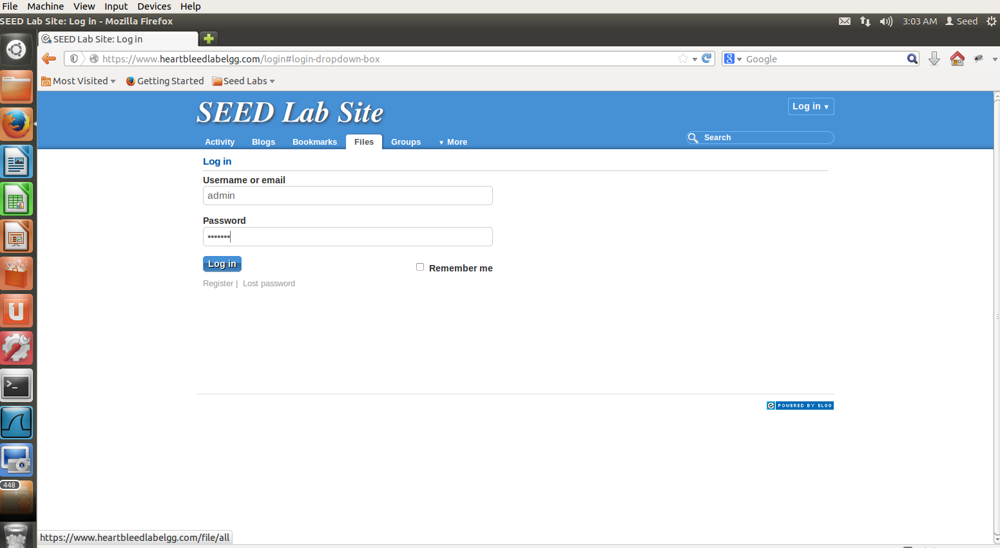
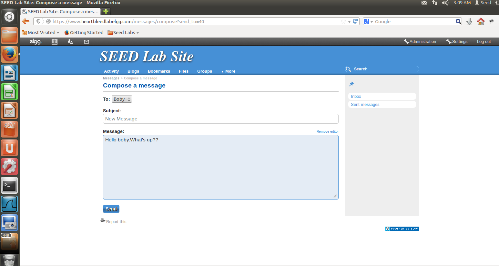
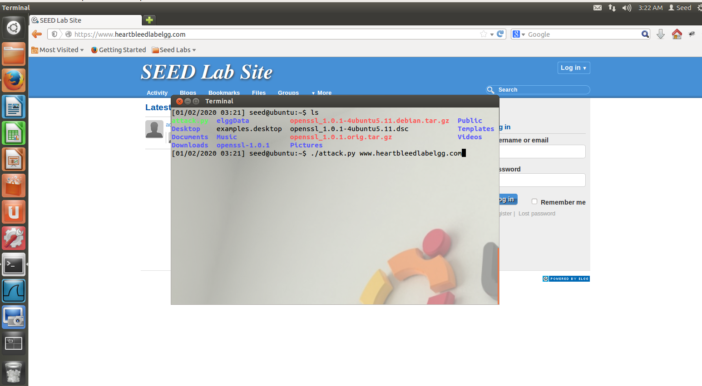

## Introduction

The Heartbleed bug is a severe implementation flaw in the OpenSSL library, which enables attackers to steal data from the 
memory of the victim server. The contents of the stolen data depend on what is there in the memory of the server. 

It could potentially contain private keys, TLS session keys, user names, passwords, credit cards, etc. 
The vulnerability is in the implementation of the Heartbeat protocol,which is used by SSL/TLS to keep the connection alive.

## How Heartbleed works

To understand how the Heartbleed vulnerability works, you need to know a little bit about how the TLS/SSL protocols operate, and how computers store information in memory.

One important part of the TLS/SSL protocols is what's called a heartbeat. Essentially, this is how the two computers communicating with one another let each other know that they're still connected even if the user isn't downloading or uploading anything at the moment. Occasionally, one of the computers will send an encrypted piece of data, called a heartbeat request, to the other.

The second computer will reply back with the exact same encrypted piece of data, proving that the connection is still in place. Crucially, the heartbeat request includes information about its own length.

So, for example, if you're reading your Yahoo mail but haven't done anything in a while to load more information, your web browser might send a signal to Yahoo's servers saying, in essence, "This is a 40 KB message you're about to get. Repeat it all back to me." (The requests can be up to 64 KB long.) When Yahoo's servers receive that message, they allocate a memory buffer — a region of physical memory where it can store information — that's 40 KB long, based on the reported length of the heartbeat request. Next, it stores the encrypted data from the request into that memory buffer, then reads the data back out of it and sends it back to your web browser.

That's how it's supposed to work. The Heartbleed vulnerability arose because OpenSSL's implementation of the heartbeat functionality was missing a crucial safeguard: the computer that received the heartbeat request never checked to make sure the request was actually as long as it claimed to be. So if a request said it was 40 KB long but was actually only 20 KB, the receiving computer would set aside 40 KB of memory buffer, then store the 20 KB it actually received, then send back that 20 KB plus whatever happened to be in the next 20 KB of memory. That extra 20 KB of data is information that the attacker has now extracted from the web server.

## Enviroment Setup

In this lab, we need to set up two VMs: one called attacker machine and the other called victim server.We use the pre-built 
<a href="https://seedsecuritylabs.org/lab_env.html">SEEDUbuntu12.04</a> VM. The VMs need to use the NAT-Network adapter for
the network setting. This can be done by going to the VM settings, picking Network, and clicking the Adaptor tag to switch 
the adapter to NAT-Network. Make sure both VMs are on the same NAT-Network.

The website used in this attack can be any HTTPS website that uses SSL/TLS. However, since it is
illegal to attack a real website, we have set up a website in our VM, and conduct the attack on our own VM. We use an open-source social network application called ELGG, and host it in the following URL: https://www.heartbleedlabelgg.com.

## Launch the attack

The actual damage of the Heartbleed attack depends on what kind of information
is stored in the server memory. If there has not been much activity on the server, you will not be able to steal 
useful data. Therefore, we need to interact with the web server as legitimate users. Let us do it as the administrator, 
and do the followings:item Visit https://www.heartbleedlabelgg.com from your browser.

* Visit https://www.heartbleedlabelgg.com from your browser.

* Login as the site administrator. (User Name:admin; Password:seedelgg)

* Add Boby as friend.

* Send Boby a private message.

After you have done enough interaction as legitimate users, you can launch the attack and see what information you can 
get out of the victim server.The code that we use is called <a href="http://www.cis.syr.edu/~wedu/seed/Labs_12.04/Networking/Heartbleed/attack.py">attack.py</a> which was originally written by Jared Stafford.

You may need to run the attack code multiple times to get useful data. Try and see whether you can get the following 
information from the target server:

* User name and password.

* Admin Activity

To fix the Heartbleed vulnerability, the best way is to update the OpenSSL library to the newest version.This can be 
achieved using the following commands:

* sudo apt-get update
* sudo apt-get upgrade
