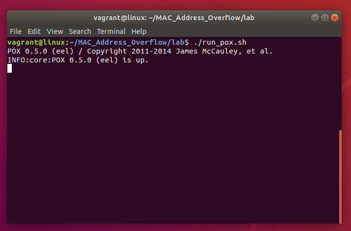
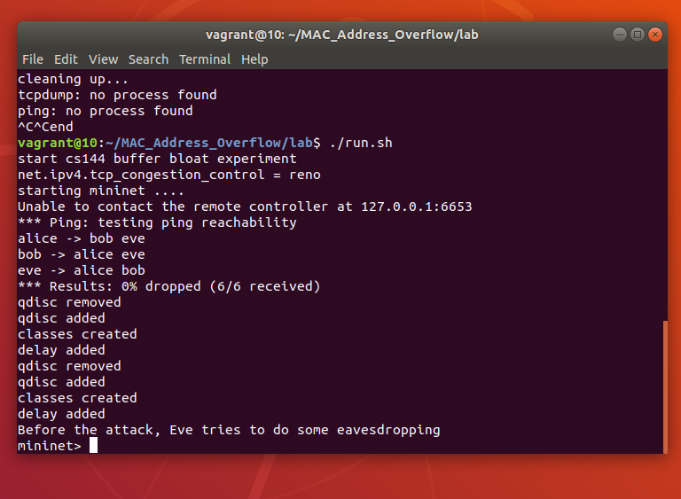
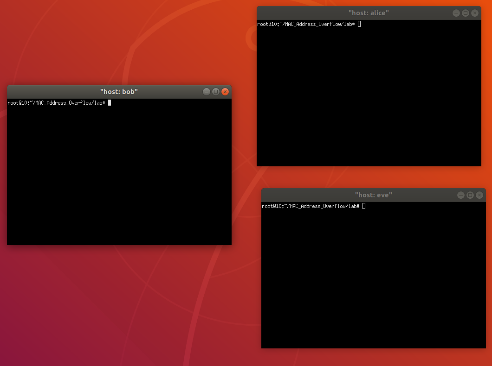
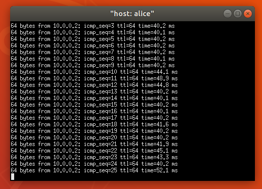
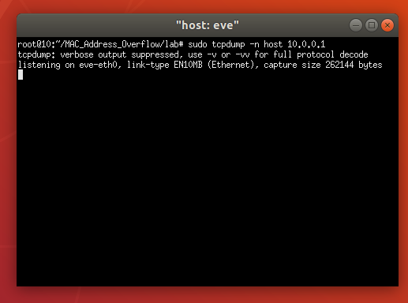
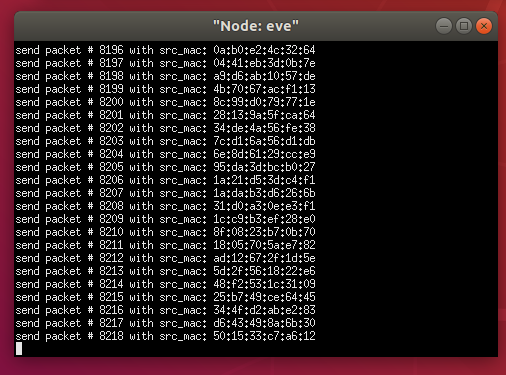
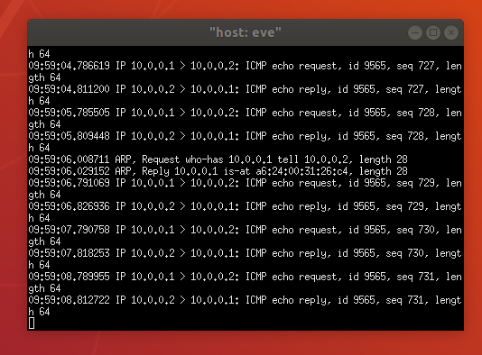

## Introduction

MAC address flooding attack is very common security attack. MAC address table in the switch has the MAC addresses available 
on a given physical port of a switch and the associated VLAN parameters for each.

This attacks are sometimes called MAC address table overflow attacks. To understand the mechanism of a MAC address table overflow attack we must recall how does a switch work in the first place.

## Enviroment Setup

Firstly, we open up a terminal and type the below command:

* sudo apt update && sudo apt upgrade

After that our system is already updated and set  in order to download the packages that we need for this lab.We will use a GitHub repository to retrieve the source code that we will use.So we clone the repository locally.

## Install Python and Clone the repository

* sudo apt install git && git clone https://github.com/echatzief/MAC_Address_Overflow
* sudo apt install python
* sudo apt install python-pip

## Install prerequisites

* cd MAC_Address_Overflow/ 
* sudo apt-get update 
* sudo apt-get install -y git vim-nox python-setuptools python-all-dev flex bison traceroute 
* pip install impacket

## Install Mininet

* cd mininet
* ./util/install.sh -fnv
* sudo apt-get install mininet
* sudo apt-get install xterm

## Install ltprotocol

* cd .. && cd ltprotocol/
* pip install setuptools
* sudo python setup.py install   

## Link POX into the Directory

* cd .. && cd lab
* rm pox && ln -s ../pox/

## Configure the Environment

* bash ./config.sh

## Attack Demonstration

Firstly we launch a terminal in order to start the POX network controller, which will emulate the behavior of a L2 learning switch.

* ./run_pox.sh

In another terminal (if you are using a remote machine, make sure the X-forwarding is enabled.):

* ./run.sh

This will start the Mininet network emulator and there will be terminals pops up for each of the nodes in the network. Close the terminals for switches and controllers, but keep the terminals for Alice, Bob and Eve.

## In Alice's Terminal

Alice will now create some traffic by pinging Bob:

* ping 10.0.0.2

You should be able to see some output like the following:

## In Eve's Terminal

We will now run tcpdump to eavesdrop the traffic betweeh Alice (10.0.0.1) and Bob (10.0.0.2):

* sudo tcpdump -n host 10.0.0.1

Since the switch between Alice/Bob/Eve already learned about the address of Alice and Bob, it will not boradcast the packet and therefore Eve will not be able to see the packets between Alice and Bob.

Now, we will let Eve generate some ethernet packets with randomly generated source MAC address to overflow switches' MAC address table. To do so, let's create another terminal in screen for Eve by (Ctrl-a + c), then run the following command in the new screen:

* python attack.py 

You should be able to see Eve starts sending a lot of packets into the network.

Back to Eve's first terminal (switch back by "ctrl+a 0). After the attack traffic overflowed swtiches' address table, switches will start to broadcast Alice and Bob's traffic and they should start showing up in Eve's tcpdump trace:

