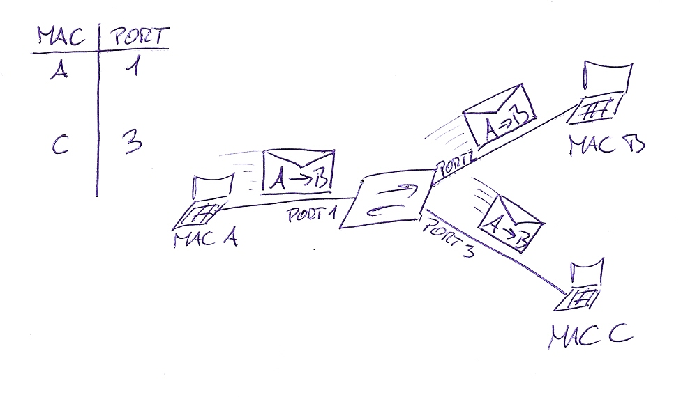

## Introduction

MAC address flooding attack is very common security attack. MAC address table in the switch has the MAC addresses available
on a given physical port of a switch and the associated VLAN parameters for each.

This attacks are sometimes called MAC address table overflow attacks. To understand the mechanism of a MAC address table overflow attack we must recall how does a switch work in the first place.

## Switch before attack

When switch receives a frame, it looks in the MAC address table (sometimes called CAM table) for the destination MAC address. When frames arrive on switch ports, the source MAC addresses are learned from Layer 2 packet header and recorded in the MAC address table.

If the switch has already learned the MAC address of the computer connected to his particular port then an entry exists for the MAC address. In this case the switch forwards the frame to the MAC address port designated in the MAC address table. If the MAC address does not exist, the switch acts like a hub and forwards the frame out every other port on the switch while learning the MAC for next time.

  

Computer A sends traffic to computer B. The switch receives the frames and looks up the destination MAC address in its MAC address table. If the switch does not have the destination MAC in the MAC address table, the switch then copies the frame and sends it out every switch port like a broadcast. This means that not only PC B receives the frame, PC C also receives the frame from host A to host B, but because the destination MAC address of that frame is host B, host C drops that frame.

  

## Normal switch function

PC B receives the frame and sends a reply to PC A. The switch then learns that the MAC address for PC B is located on port 2 and writes that information into the MAC address table. From now on any frame sent by host A (or any other host) to host B is forwarded to port 2 of the switch and not broadcast out every port. The switch is working like it should. This is the main goal of switch functionality, to have separate collision domain for each port on the switch.

  

## Attack

But this is where the attacker is coming into play. The key to understanding how MAC address table overflow attacks work is to know that MAC address tables are limited in size. MAC flooding makes use of this limitation to send to the switch a whole bunch of fake source MAC addresses until the switch MAC address table is fully loaded and can not save any more MAC address – Port mapping entries.

The switch then enters into a fail-open mode that means that it starts acting as a hub. In this situation switch will broadcasts all received packets to all the machines on the network. As a result, the attacker (in our case “PC C”) can see all the frames sent from a victim host to another host without a MAC address table entry.

  

In this case, an attacker will use legitimate tools for malicious actions. The figure shows how an attacker can use the normal operating characteristics of the switch to stop the switch from operating.

Let’s get into more detail about filling up the MAC address table. To do this attacker uses network attack tools for MAC. The network intruder uses the attack tool to flood the switch with a large number of invalid source MAC addresses until the MAC address table fills up. When the MAC address table is full, the switch floods all ports with incoming traffic because it cannot find the port number for a particular MAC address in the MAC address table. The switch, in essence, acts like a hub.In this lab we will reproduce the above example in order to understand how this attack works.

## Enviroment Setup

Firstly, we open up a terminal and type the below command:

- sudo apt update && sudo apt upgrade

After that our system is already updated and set in order to download the packages that we need for this lab.We will use a GitHub repository to retrieve the source code that we will use.So we clone the repository locally.

## Install Python and Clone the repository

- sudo apt install git && git clone https://github.com/echatzief/MAC_Address_Overflow
- sudo apt install python
- sudo apt install python-pip

## Install prerequisites

- cd MAC_Address_Overflow/
- sudo apt-get update
- sudo apt-get install -y git vim-nox python-setuptools python-all-dev flex bison traceroute
- pip install impacket

## Install Mininet

- cd mininet
- ./util/install.sh -fnv
- sudo apt-get install mininet
- sudo apt-get install xterm

## Install ltprotocol

- cd .. && cd ltprotocol/
- pip install setuptools
- sudo python setup.py install

## Link POX into the Directory

- cd .. && cd lab
- rm pox && ln -s ../pox/

## Configure the Environment

- bash ./config.sh

## Attack Demonstration

Firstly we launch a terminal in order to start the POX network controller, which will emulate the behavior of a L2 learning switch.

- ./run_pox.sh

In another terminal (if you are using a remote machine, make sure the X-forwarding is enabled.):

- ./run.sh

This will start the Mininet network emulator and there will be terminals pops up for each of the nodes in the network. Close the terminals for switches and controllers, but keep the terminals for Alice, Bob and Eve.

## In Alice's Terminal

Alice will now create some traffic by pinging Bob:

- ping 10.0.0.2

You should be able to see some output like the following:

## In Eve's Terminal

We will now run tcpdump to eavesdrop the traffic betweeh Alice (10.0.0.1) and Bob (10.0.0.2):

- sudo tcpdump -n host 10.0.0.1

Since the switch between Alice/Bob/Eve already learned about the address of Alice and Bob, it will not boradcast the packet and therefore Eve will not be able to see the packets between Alice and Bob.

Now, we will let Eve generate some ethernet packets with randomly generated source MAC address to overflow switches' MAC address table. To do so, let's create another terminal in screen for Eve by (Ctrl-a + c), then run the following command in the new screen:

- python attack.py

You should be able to see Eve starts sending a lot of packets into the network.

Back to Eve's first terminal (switch back by "ctrl+a 0). After the attack traffic overflowed swtiches' address table, switches will start to broadcast Alice and Bob's traffic and they should start showing up in Eve's tcpdump trace:

